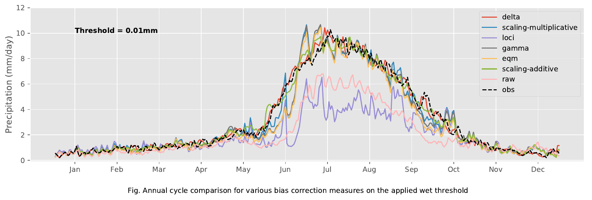
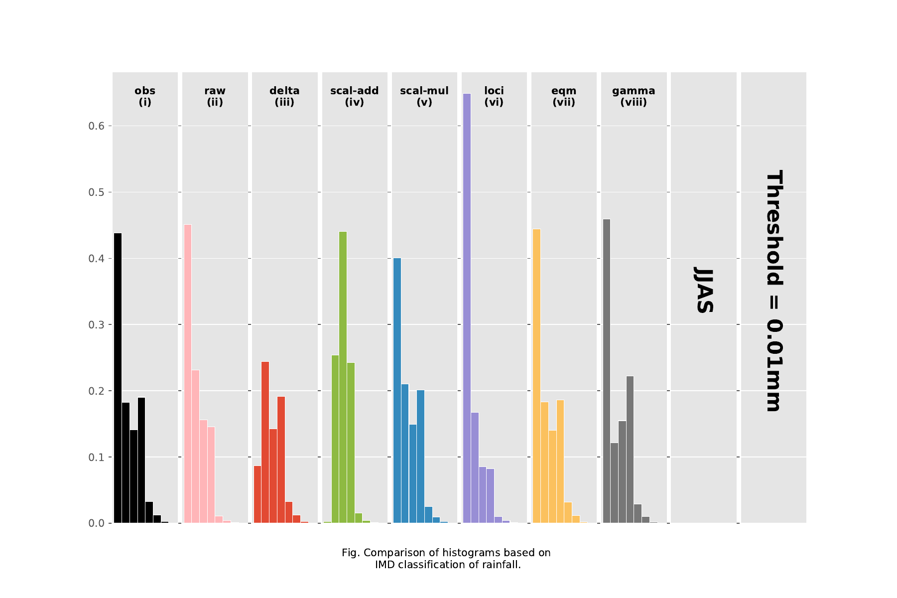
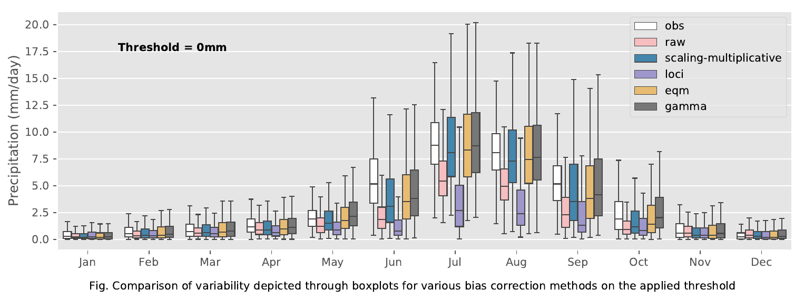

# Statistical bias correction of climate model simulations

## Introduction
Global Climate Models (GCMs) have been the primary source of information for constructing climate scenarios, and they provide the basis for climate change impacts assessments of climate change at all scales, from local to global. However, impact studies rarely use GCM outputs directly because climate models exhibit systematic error (biases) due to the limited spatial resolution, simplified physics and thermodynamic processes, numerical schemes or incomplete knowledge of climate system processes . Errors in GCM simulations relative to historical observations are large (Ramirez-Villegas et al. 2013). Hence, it is important to bias-correct the raw climate model outputs in order to produce reliable climate projections.

## Methods
Analysed an ensemble of regional (CORDEX) and global (CMIP5) climate model simulations and compared the performance of various statistical algorithms for debiasing future climate projections. Implemented the algorithms, and visualized the results using both R and python. 

The following statistical bias correction algorithms are implemented using R:

* **Delta** (`method = "delta"`)
* **Scaling** (`method = "scaling"`)
* **Empirical Quantile Mapping (eQM)** (`method = "eqm"`)
* **Parametric Quantile Mapping: gamma distribution (gQM)** (`method = "pqm"`)
* **Special case of Parametric Quantile Mapping: gamma and Generalized Pareto Distribution (gpQM)** (`method = "gpqm"`)
* **Variance scaling of temperature** (`method = "variance"`)
* **Local intensity scaling of precipitation** (`method = "loci"`)
* **Power transformation of precipitation** (`method = "ptr`)

## Results 

